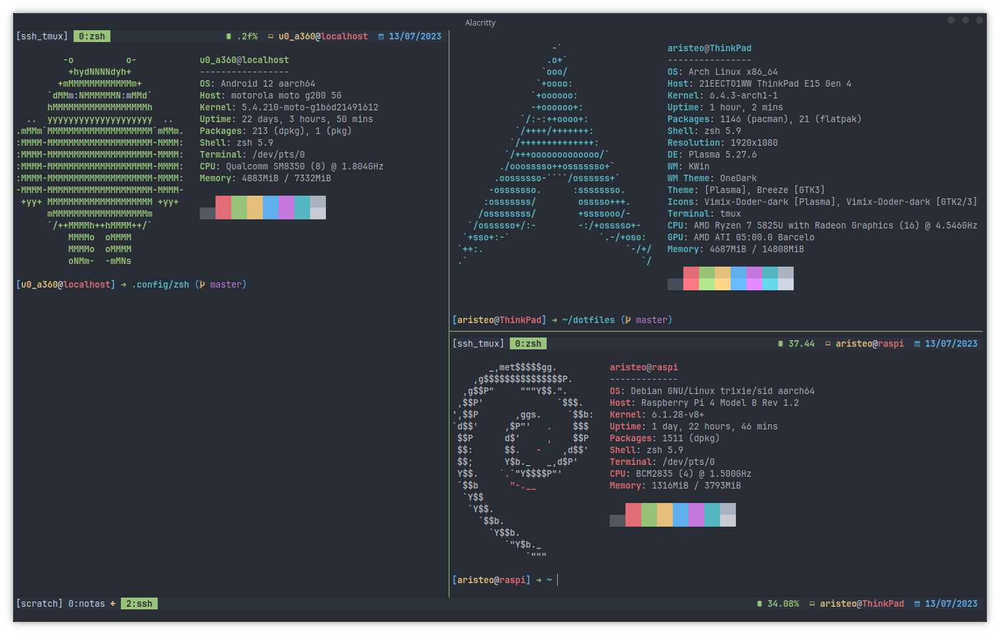

# Linux dotfiles
Most of what you see here isn't used except for tmux, alacritty, zsh, ideavim and nvim. I moved back to KDE as my DE for now.

Hopefully I'll be using neovim for java in the future.

## Disclaimer
I'm also using stow to manage my dotfiles, but there are still some things to address.
